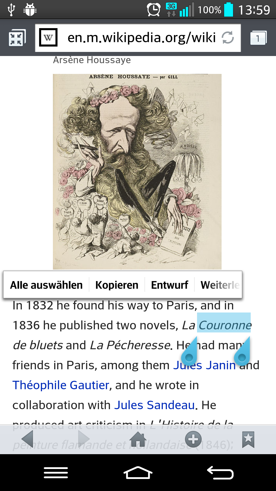
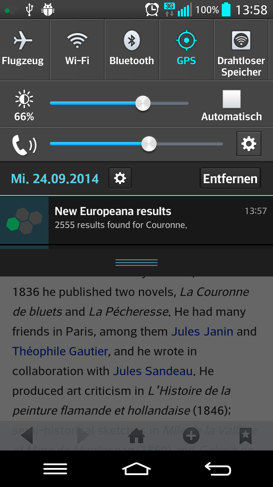
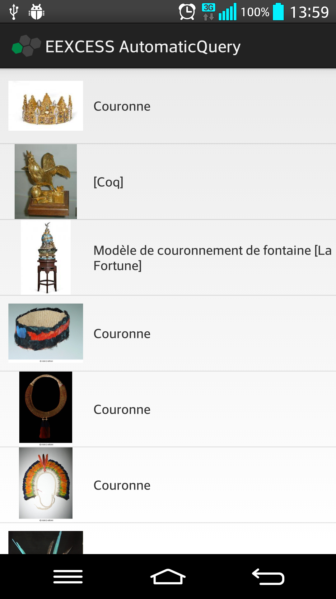

# Contextopheles
Contextopheles is a mobile just-in-time retrieval application for the Android platform. Based on the current user context, it proactively retrieves and presents cultural heritage objects from Europeana. 

For example, if a text selection is copied to the clipboard, the content of the clipboard is analyzed and a corresponding query is sent to Europeana (see <a href="#screen-1">image 1</a>). 
If this query yields results, a little icon appears in the notification bar (see <a href="#screen-2">image 2</a>). Investigating this notification, a message with the query terms and the amount of received results is shown. Selecting the query displays the results in a list (see <a href="#screen-3">image 3</a>). A screencast of this interaction process in conjunction with (fake) location information is available at <a href="demo/location_selection.mp4">demo/location_selection.mp4</a>. If you want to install and test the application, please visit the <a href="APKs">APKS</a>-folder.

## Project Setup
This document should help to get the Contextopheles project up and running.

The project has been created using Android Studio and the cradle build system.
If either of those has been updated ever since, you most likely will have to adapt something in the project.

## Project Organisation

* BKS: needed to make a keystore (for Mingle.IO)
* Frameworks: the Frameworks used
* Plugins: The main context plugins for Contextopheles
* Prototypes: The prototype apps.
* Support: Support apps

## Important notes:

The AWARE Framework needs to be built both as an app and a framework.
1. make sure that the build.gradle in Frameworks/aware_framework_v2 reads

    apply plugin: 'android'
    //apply plugin: 'android-library'

clean, sync gradle and build it as an APK.

2. To build the other modules, change the build.gradle to

    apply plugin: 'android'
    //apply plugin: 'android-library'

and then sync gradle and build.

All Modules can be updated easily using the ALL build target in Android Studio.

Always install the AWARE app first to avoid running into permission problems!